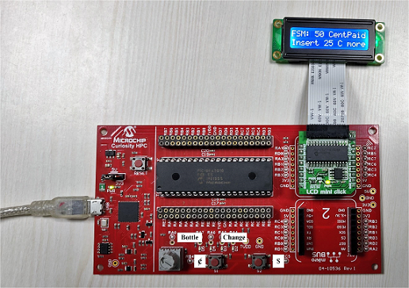
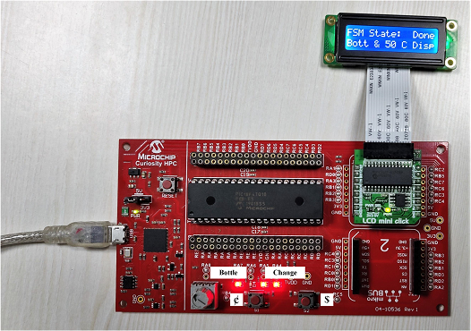

<!-- Please do not change this html logo with link -->

# Vending machine using Configurable Logic Cells

<!--This project demonstrate the uses of CLCs in real time applications.In this demo we will realize a 3-state Finite State Machine using CLCs and other Core Independent Peripherals(CIPs). -->

## Introduction
This demo illustrates the use of Configurable Logic Cells (CLC) in designing finite state machines (FSM). For demonstration vending machine is implemented as 3 state FSM. This demo can also be used with PIC devices which has CLC peripheral, this example is built on PIC18F47Q10 device using curiosity HPC board. The PIC18F Q10 family of devices are equipped with 8 CLCs. The Configurable Logic Cell (CLC) is a flexible peripheral that enables creation of on-chip custom logic functions for PIC® microcontrollers. It can be configured with basic logic functions such as Logic Gates, Flip Flops and Latches.

## Related Application Note

- [Using CLC in Real Time Applications](http://ww1.microchip.com/downloads/en/AppNotes/AN2912-Using-CLCs-in-Real-Time-Apps_00002912A.pdf "Using CLC in Real Time Applications")
- [Configurable Logic Cells Tips ‘n’ Tricks](http://ww1.microchip.com/downloads/en/devicedoc/41631b.pdf "Configurable Logic Cells Tips ‘n’ Tricks")

## Application Overview

Let’s assume a vending machine dispensing bottle/can for 75₵ and user can enter coins in denominations of 1$ or 25₵.

* Customers can insert either a dollar (1$) or quarters (25₵). Once enough money is inserted, the vending machine dispenses a bottle/can.
 1. If the customer inserts a dollar, it will return one quarter as change along with the purchased bottle/can.
 2. If the customer inserts three quarters a bottle/can will be dispensed.
* A “Money Receiver” detects when money has been inserted in the vending machine.
* The money receiver sends two logic signals to the circuit indicating whether a dollar or quarter was inserted.
* A “Bottle/Can Dispenser” system holds the bottles/cans and will release one bottle/can when its input signal is asserted.
* A “Coin Return” system holds quarters for change and will release coins when its input signal is asserted.
* Depending on the inserted amount of money, it returns the correct change, as follows:
 1. It returns a quarter if a dollar is inserted.
 2. It returns two quarters if a dollar is inserted after a quarter.
 3. It returns three quarters if a dollar is inserted after two quarters.
 4. In all the above cases, the Bottle/Can Dispenser releases a bottle, or a can.

The system also generates an error condition when a dollar and a quarter are inserted simultaneously.

 

## Hardware Used

* [PIC18F47Q10 MCU](https://www.microchip.com/wwwproducts/en/PIC18F47Q10 "PIC18F47Q10 MCU") 40-pin PDIP is used with [Curiosity HPC](https://www.microchip.com/DevelopmentTools/ProductDetails/PartNO/DM164136 "Curiosity HPC") development board from Microchip.
* [LCD mini click](https://www.mikroe.com/lcd-mini-click "LCD mini click") board from MikroElektronika.

  
   Fig 1 : PIC18F47Q10 MCU with LCD Mini Click 

## Software Used

Microchip’s free MPLAB X IDE, compiler and MPLAB Code Configurator (MCC) graphical code generator are used throughout the application firmware development to provide easy and hassle-free user experience. Following are the tool versions used for this demo application:

* [MPLAB X IDE v5.20](https://www.microchip.com/mplab/mplab-x-ide "MPLAB X IDE v5.20")
* [XC8 Compiler v2.05](https://www.microchip.com/mplab/compilers "XC8 Compiler v2.05")
* [MPLAB Code Configurator (MCC) v3.75](https://www.microchip.com/mplab/mplab-code-configurator "MPLAB Code Configurator (MCC) v3.75")

**Note: For running the demo, the installed tool versions should be same or later. This example is not tested with previous versions.**

## Application Description

To implement the vending machine demo, a state table can be made for all the possible states of vending machine.

FSM states are:

* Wait 00
* 25₵ 01
* 50₵ 10

  
   Fig 2 : Boolean table for the FSM states 

This Boolean table can be easily simplified using K-map technique into individual expressions for each of the output giving us the result in form of simple logical equations.

Solving for next state:

* P = B C’D + A C’D’
* Q = A’B’C’D + B C’D’

Solving for dispense outputs and error state:

* R = C D’ + A C’D
* S = B C D’ + A C D’
* T = B’C D’
* E = C D

Apart from these logical operations it can be inferred that previous state is also needed for computing the next states and dispense signals. Hence, sequential circuit using D flip-flop can be used to save previous state.

* A = previous of ( P )
* B = previous of ( Q )

These equations can be implemented using logic circuits. For each output we will configure one CLC. The configuration is done using MCC which supports easy graphical interface for CLC configuration.

## Vending Machine implementation

The general idea of the application is to implement all the logical computations using CLCs. All the logical expressions derived from State Transition Table can be realized using CLCs. By setting them in various gate configurations, the CLCs are used to get the required logical expression.

The required inputs are dollar, quarter and current state, whereas outputs are next state, dispense of bottle and change. To implement the vending machine using the Curiosity HPC board some simulation is required to create full application environment. Hence, for demonstration, the dollar and quarter inputs are simulated using push buttons S2 and S1, respectively, present on the board.

For switch de-bouncing, timers TMR2 and TMR4, in Monostable mode, are used for each switch. These timers will generate one low pulse of programmed time at each switch press. As this pulse is of low polarity, each switch press will give logic ‘0’, so it needs to be inverted before input to CLC. This can be easily implemented by using the input polarity selection of the CLC.

Similarly, for demonstration purpose on-board LEDs are used to indicate dispense outputs. LED D5 is used to show bottle dispense whereas LEDs D4, D3 and D2 are used to show each quarter out. The extra money received will be dispensed as change, up to 3 quarters can be released as change. The output is triggered by CLC interrupts of the respective CLC output, where the LEDs are turned on. For maintaining the turn on duration of the LEDs, a separate timer TMR5 is used. It starts with LED on event and gives an interrupt after three seconds, where LEDs are turned off again, and TMR5 is stopped.

  
   Fig 3 : Curiosity HPC Board 

FSM states and dispense messages are displayed accordingly on the LCD, in synchronization with the system state and dispense outputs. The mikroElektronika LCD mini click is used as display unit, the LCD driver using SPI1 is MCC-generated, and display routines are manually written. After some period of inactivity, set by the user, the controller is put into IDLE mode and the LCD backlight is turned off, to reduce power consumption. The system automatically wakes up on any switch-press event, which is implemented by using the switches’ timer output interrupt. The same interrupt is used to clear the user inactivity timeout.

## MCC Configuration

MCC – MPLAB® Code Configurator is a graphical programming environment that generates seamless, easy to understand C code to give a head start to the project, saving the designer’s time to initialize and configure all the modules, and to go through the datasheets. Using an instructive interface, it enables and configures all peripherals and functions specific to the application requirements. For more details please visit
[http://www.microchip.com/mplab/mplab-code-configurator](http://www.microchip.com/mplab/mplab-code-configurator "http://www.microchip.com/mplab/mplab-code-configurator")

MCC is used for this demo to create the initialization and peripheral configuration code:

* System configuration for clock settings
* CLC configurations for logic expressions
* Timer configurations for Switch and LED delay
* LCD mini click SPI configuration and respective code generation.

These configuration steps are detailed below:

## Timer Configuration for Switch

TMR2 and TMR4 are used in Monostable mode for switch de-bouncing, a period of 250 ms is programmed for the de-bounce. The timer is triggered with the rising edge of the switch release event. The timer clock and other options are selected to get the desired timer period of 250ms, these settings need not to be identical to the settings given here. The timer output is directly fed into the CLC, yet timer interrupts are enabled for wake-up from Sleep mode. Following is the screenshot of TMR2 configuration, TMR4 configuaration is also same.

  
   Fig 4 : TIMER 2 Configuration Window 

## CLC configuration

According to the logic expressions derived in Application Description CLC are configured.

* CLC 1: 1-input D flip-flop

  
   Fig 5 : CLC 1: 1-input D flip-flop 

* CLC 2: 1-input D flip-flop

  
   Fig 6 : CLC 2: 1-input D flip-flop 

* CLC 3: 4-input AND

  
   Fig 7 : CLC 3: 4-input AND 

* CLC 4: 4-input NAND

  
   Fig 8 : CLC 4: 4-input NAND 

* CLC 5: 4-input AND, Interrupt Enable (Rising Edge)

  
   Fig 9 : CLC 5: 4-input AND, Interrupt Enable (Rising Edge) 

* CLC 6: 4-input AND, Interrupt Enable (Rising Edge)

  
   Fig 10 : CLC 6: 4-input AND, Interrupt Enable (Rising Edge) 

* CLC 7: 4-input AND, Interrupt Enable (Rising Edge)

  
   Fig 11 : CLC 7: 4-input AND, Interrupt Enable (Rising Edge) 

* CLC 8: 4-input AND, Interrupt Enable (Rising Edge)

  
   Fig 12 : CLC 8: 4-input AND, Interrupt Enable (Rising Edge) 

## Timer configuration for LED delay

  
   Fig 13 : Timer configuration for LED delay 

## LCD configuration

MCC supports a huge range of click boards including the LCD mini click. The only configuration needs to be done is select SPI source, Pin, and SPI speed. For LCD mini click mikroBUS slot 1 of Curiosity HPC is used, pins for the same are selected in the Pin Manager.

## Pin Manager view

  
   Fig 14 : CLC 1: 1-input D flip-flop 

## Operation

After configuring all the peripherals some programming is required for LCD display. Depending on the CLC output the FSM state is displayed over the LCD. The code for this is written in “application.c” file. To evaluate the operation of vending machine we can follow the following steps. The dispenses is shown on LEDs and for each dispense LCD message is also printed.

* Wait state: After programming, system waits for coins input.

  
   Fig 15 : Wait state 

* Press Cent Switch S1 – FSM state 25 Cents.

  
   Fig 16 : FSM state 25 Cents 

* Press Cent Switch S1 twice – FSM state 50 Cents

  
   Fig 17 : FSM state 50 Cents 

* Press Cent Switch S1 thrice – 1 bottle dispense

  
   Fig 18 : 1 bottle dispense 

* Press Dollar Switch S2 – 1 bottle and 1 quarter (25₵) dispense

  
   Fig 19 : 1 bottle and 1 quarter (25₵) dispense 

* Press Cent Switch S1 and then Press Dollar switch S2 – 1 bottle and 2 quarter (50₵) dispense

  
   Fig 20 : 1 bottle and 2 quarter (50₵) dispense 

* Press Cent Switch S1 twice and Press Dollar switch S2 – 1 bottle and 3 quarter (75₵) dispense

  
   Fig 21 : 1 bottle and 3 quarter (75₵) dispense 

## Conclusion

The vending machine demonstration easily shows how to use CIPs in real time application. The timers in monostable mode are used for switch debouncing and similarly CLCs are used for creating a sequential logic circuit for Finite state machine. Since the logic functions implemented in the hardware have faster event response compared to the logic functions implemented in the software, the CLC gives the advantage of faster and predictable response to users. It provides a higher level of integration without the need of external logic gates to implement the logic functions, therefore it can reduce the size of a PCB. It also helps in combining various input source signals using different logic gates and produce combined logical output signals.
